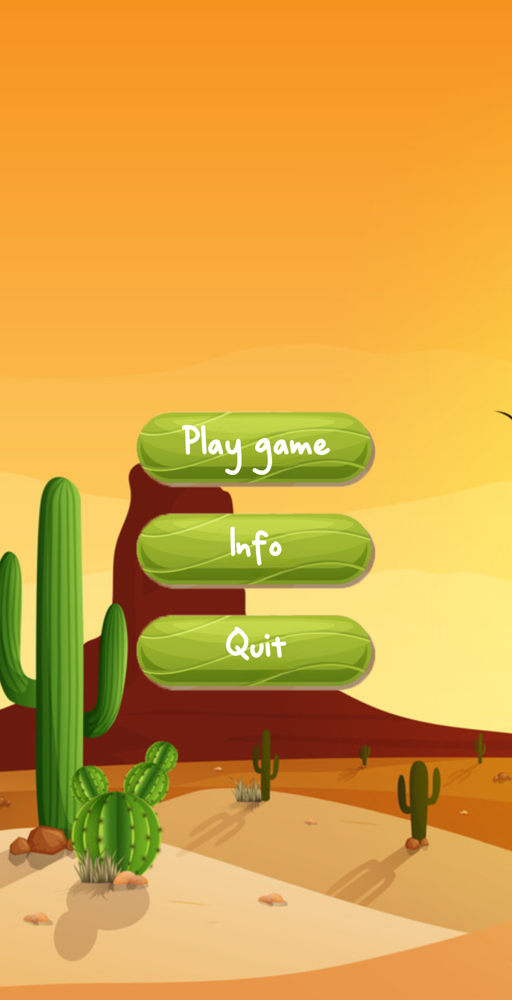

# Game-2048

2048 is a classic number puzzle game where players slide tiles to merge them and reach the 2048 tile. This Android version brings smooth gameplay with intuitive touch controls.

## 🎮 Features

- **Simple & Addictive Gameplay** 🎯
- **Smooth Tile Movements with Elastic View** 🔄
- **Save & Load Game Progress using SharedPreferences** 💾
- **Interactive Touch Controls with OnTouchListener** ✋

## 🛠 Technologies Used

- **OnTouchListener** for Gesture Handling 🎮
- **SharedPreferences** for Saving Game State 💾
- **Elastic View** for Smooth Animations 🔄

## 📸 Screenshots

Below are some screenshots of the application:

<table>
  <tr>
    <td></td>
    <td></td>
    <td></td>
  </tr>
</table>

## 🚀 Try the App

Download the APK and try it out.

---

**Author: Imotdinov Bunyodbek**  
**Contact: [imotdinovbunyodbek2@gmail.com](mailto:imotdinovbunyodbek2@gmail.com)
